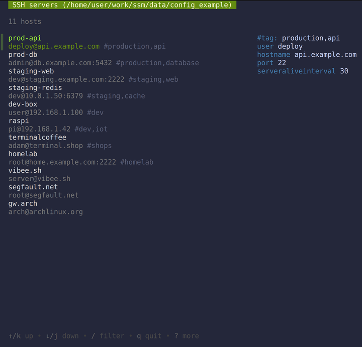

# SSM 🐚

[](https://github.com/lfaoro/ssm)
[](https://github.com/lfaoro/ssm/releases)
[](https://github.com/lfaoro/ssm/actions)
[](https://github.com/lfaoro/ssm/releases)
[](https://goreportcard.com/report/github.com/lfaoro/ssm)
[](LICENSE)

Secure Shell Manager -- **Your SSH config on TUI-roids.**

`ssm` is a tiny terminal UI that sits on top of your existing SSH config. No changes needed on your servers.

## Demo



## Quick Start

```bash
ssm                    # launch TUI
ssm production         # filter by tag
ssm -se vpn            # show config + exit after connect
ssm --theme matrix     # green hacker vibes
ssm --theme sky        # soft blue vibes
```

## Install

### One-liner

```bash
curl -fsSL https://github.com/lfaoro/ssm/raw/main/scripts/get.sh | bash
# macOS quarantine workaround
xattr -d com.apple.quarantine /path/to/ssm
```

### Package Managers

| Platform | Command |
|---|---|
| macOS / Linux | `brew install lfaoro/tap/ssm` |
| Arch Linux | `yay -S ssm-bin` (AUR) |
| Nix | `nix profile install github:lfaoro/tap#ssm` |
| Go | `go install github.com/lfaoro/ssm@latest` |
| deb / rpm | Download from [Releases](https://github.com/lfaoro/ssm/releases) |

### Pre-built Binaries

Download the latest archive for your platform from the [releases page](https://github.com/lfaoro/ssm/releases), then:

```bash
tar xzf ssm_*.tar.gz
sudo mv ssm /usr/local/bin/
```

## Keys You'll Actually Use

| Key | What it does |
|---|---|
| `enter` | Connect |
| `ctrl+e` | Edit config live |
| `ctrl+r` | Run command on host |
| `ctrl+s` | SFTP file browser |
| `ctrl+v` | Toggle config inspector |
| `tab` | Switch SSH ↔ MOSH |
| `/` | Fuzzy search |
| `q` | Quit |

Full list in the app with `?`

## Usage

```
ssm [command] [flags]

Commands:
  (none — ssm launches directly into the TUI)

Flags:
  -s, --show          Show config viewport on launch
  -e, --exit          Exit after connecting (uses syscall.Exec)
  --theme <name>      Color theme: sky (default), matrix
  --config <path>     Custom SSH config path
  --debug             Enable debug logging
  -v, --version       Show version
  -h, --help          Show help
```

### Tag Filtering

Pass a positional argument to filter hosts by tag on launch:

```bash
ssm production    # show only hosts tagged "production"
ssm web           # show only hosts tagged "web"
```

### Themes

```bash
ssm --theme matrix    # green on black
ssm --theme sky       # soft blue
```

Want more themes? PRs welcome.

## SSH Config Tips

Add tags like this:

```ssh-config
Host myserver
#tag: production,web
    User admin
    HostName 10.0.0.5
    ...
```

The more tags you use, the better it gets.

`ssm` also respects `Include` directives (recurses up to depth 10 with cycle detection) and `#tagorder` for custom host sorting.

## Architecture

```
ssm
├── main.go              # CLI entry (urfave/cli v3), version check, syscall.Exec
└── pkg/
    ├── sshconf/         # SSH config parser
    │   ├── parser.go    # Thread-safe parsing, Include recursion, #tag: comments
    │   └── util.go      # Helpers, sensitive key filtering, symlink resolution
    └── tui/             # Bubbletea v2 TUI
        ├── model.go     # Root model, state management, sub-model coordination
        ├── list.go      # Host list, fuzzy search, tag filtering
        ├── runcmd.go    # Remote command execution sub-model
        ├── sftp.go      # SFTP file browser sub-model
        ├── syscmd.go    # SSH/mosh process management, signal handling
        ├── log.go       # Debug logging (debug-mode only)
        └── themes.go    # Color themes (sky, matrix)
```

## Development

Requires [Go 1.26+](https://go.dev/doc/install).

```bash
git clone https://github.com/lfaoro/ssm.git && cd ssm
make build              # compile binary to ./bin/ssm
make test               # run all tests with race detection
make lint               # golangci-lint (or go fmt + go vet)
make bench              # run benchmarks
make release-dev        # goreleaser snapshot (dry run)
```

## Security

- Config file permissions checked (warns if not `0600`)
- SSH stderr sanitized (truncated to 500 chars)
- ANSI escape sequences stripped from remote output
- Sensitive keys (identityfile, proxycommand, etc.) filtered from config viewport
- SFTP uses `BatchMode=yes` + `RequestTTY=no` to prevent interactive prompts
- `--` delimiter before hostname in all SSH/mosh/syscall invocations (anti-injection)

**That's it.**

If you live in the terminal and manage more than a couple servers, this thing just makes life a little nicer.

Star it if it helps → https://github.com/lfaoro/ssm

Made with ❤️ and too much SSH pain.

## Shoutout

**[@hackerschoice](https://x.com/hackerschoice/status/1920899798837711279)** on X

If `ssm` actually made your life better:

- [GitHub Sponsors](https://github.com/sponsors/lfaoro)
- BTC: `bc1qzaqeqwklaq86uz8h2lww87qwfpnyh9fveyh3hs`
- XMR: `89XCyahmZiQgcVwjrSZTcJepPqCxZgMqwbABvzPKVpzC7gi8URDme8H6UThpCqX69y5i1aA81AKq57Wynjovy7g4K9MeY5c`
- FIAT: [Revolut](https://revolut.me/matrix)
- [message me on Telegram](https://t.me/leonarth)

or just ⭐ the repo. Appreciate it either way.
